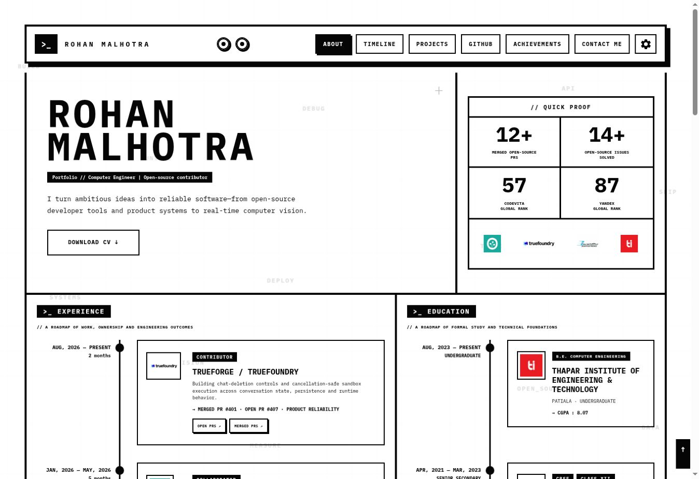
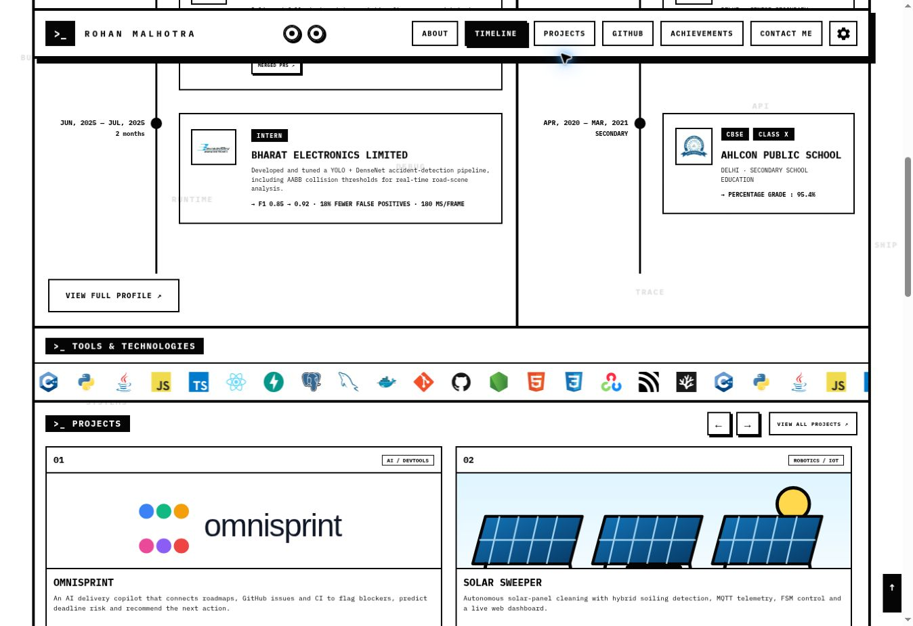
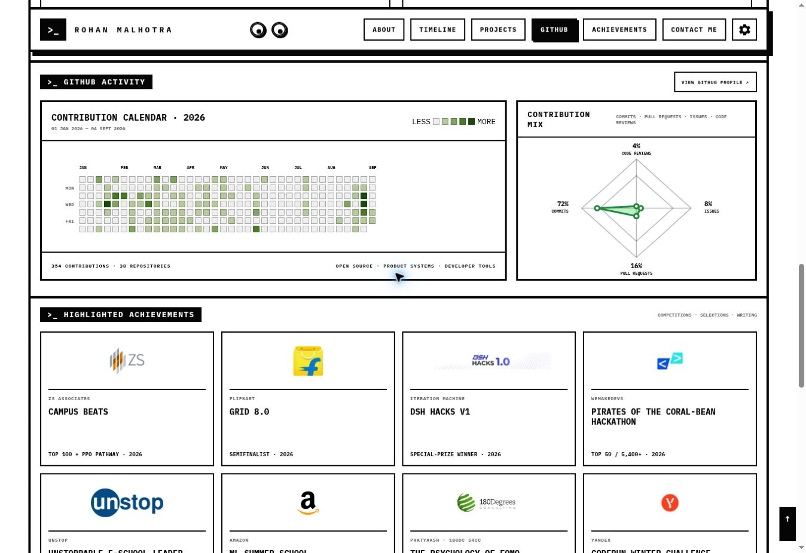

# Rohan Malhotra — Portfolio

A deliberately sharp, terminal-inspired portfolio for my work across open source, product engineering, developer tools, computer vision, and competitive programming.

**[View the live portfolio →](https://rohanmalhotracodes.github.io/)**



## Why I built it

I wanted a portfolio that felt like an engineered product rather than a collection of disconnected sections. The result is a fast, framework-free site with one visual language: strong borders, monospace typography, purposeful motion, direct calls to action, and proof close to every claim.

The interface is intentionally monochrome and brutalist, but the experience is not bare-bones. It includes responsive layouts, accessible controls, theme preferences, live GitHub data, interactive project cards, and small details such as cursor-tracking header eyes.

## What is inside

- **Selected work:** OmniSprint, now a 3× hackathon winner, and Solar Sweeper, an autonomous solar-panel cleaning system.
- **Open-source experience:** contribution work across TrueForge / TrueFoundry and the Oppia Foundation, with direct links to merged and open pull requests.
- **Education:** a compact timeline covering my Computer Engineering degree and school milestones.
- **Proof, not filler:** merged PRs, resolved issues, competition ranks, hackathon results, selections, and published work.
- **GitHub activity:** a contribution calendar, repository total, and contribution mix refreshed automatically every six hours.
- **Ways to connect:** downloadable CV, LinkedIn profile, direct email, and a contact form.

## A closer look

### Tools, projects, and clear actions

The project cards are fully clickable and also carry explicit **View project** labels. Section-level actions use the same button language, so **View all projects**, **View GitHub profile**, **View full profile**, and **Download CV** are easy to spot.



### GitHub activity and achievements

The GitHub dashboard reads from a generated local data snapshot. Visitors get a current calendar and contribution breakdown without a client-side token or a slow API request on every page load.



## Interaction details

- Content cards stay flat at rest and gain a hard-edged shadow on hover or keyboard focus.
- Buttons use explicit action copy instead of ambiguous arrow-only controls.
- Light and dark themes can be changed from the settings panel.
- Background motion can be paused, and the preference is remembered locally.
- The technology rail loops continuously and respects reduced-motion preferences.
- Navigation stays available while scrolling and tracks the active section.
- Desktop, tablet, and mobile layouts keep the same hierarchy without squeezing the content.

## GitHub activity that stays current

The activity panel is updated by [`scripts/update-github-activity.mjs`](scripts/update-github-activity.mjs). The script fetches the public contribution page for the current year, extracts daily contribution levels, totals, repository count, and contribution percentages, then writes the result to [`assets/data/github-activity.json`](assets/data/github-activity.json).

[`update-github-activity.yml`](.github/workflows/update-github-activity.yml) runs the updater:

- every six hours;
- when triggered manually; and
- whenever the updater or workflow itself changes on `main`.

If the generated JSON changes, the workflow commits only that file. The browser renders the committed snapshot, so no GitHub credential is exposed to visitors.

## Built with

- Semantic HTML5
- Modern CSS, custom properties, responsive media queries, and reduced-motion support
- Vanilla JavaScript
- IBM Plex Mono
- GitHub Actions for activity refreshes
- GitHub Pages for deployment
- FormSubmit for contact-form delivery

There is no framework, package install, bundler, or build step. That keeps the code approachable and the deployment boring—in the best way.

## Run locally

Clone the repository and serve the directory with any static-file server:

```bash
git clone https://github.com/rohanmalhotracodes/rohanmalhotracodes.github.io.git
cd rohanmalhotracodes.github.io
python3 -m http.server 8000
```

Then open [http://localhost:8000](http://localhost:8000).

To refresh the public GitHub snapshot manually:

```bash
node scripts/update-github-activity.mjs
```

Set `GITHUB_USERNAME` only if you are adapting the site for another public profile.

## Project map

| Path | Purpose |
| --- | --- |
| `index.html` | Page structure, portfolio content, links, and metadata |
| `styles.css` | Visual system, layouts, themes, hover states, and responsive behavior |
| `script.js` | Navigation, settings, motion, contact feedback, and GitHub rendering |
| `scripts/update-github-activity.mjs` | Public GitHub contribution data collector |
| `.github/workflows/update-github-activity.yml` | Six-hour refresh automation |
| `assets/data/github-activity.json` | Generated activity snapshot consumed by the browser |
| `assets/logos/` and `assets/tech/` | Organization, project, and technology artwork |
| `assets/screenshots/` | Current README previews |
| `assets/Rohan-Malhotra-Resume.pdf` | Downloadable résumé |

## Make it your own

1. Replace the portfolio copy, project links, timelines, and achievements in `index.html`.
2. Swap the logos, screenshots, favicon, and CV in `assets/`.
3. Change the design tokens and component rules in `styles.css`.
4. Update the default GitHub username in the activity script.
5. Replace the FormSubmit address before publishing your fork.

## Deployment

The site is served from the `main` branch with GitHub Pages. Every accepted change becomes a static deployment; the scheduled activity workflow keeps the GitHub panel fresh between content updates.

## Contact

- [GitHub](https://github.com/rohanmalhotracodes)
- [LinkedIn](https://www.linkedin.com/in/rohanmalhotracodes)
- [Email](mailto:rohanmalhotra430@gmail.com)

## License

The code is available under the [MIT License](LICENSE). You are welcome to reuse the implementation, but please replace my personal copy, résumé, metrics, and brand assets with your own.
