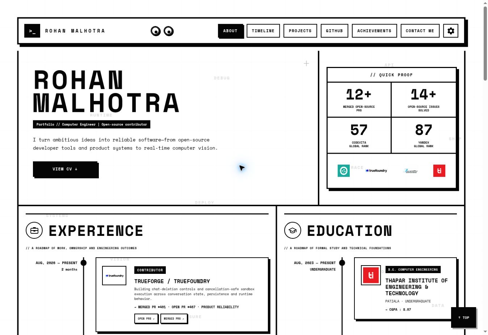
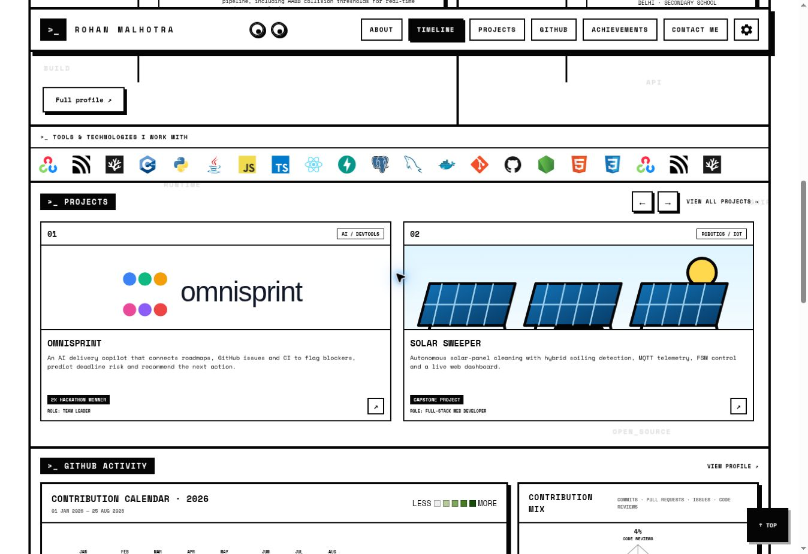

# Portfolio

A responsive, monochrome engineering portfolio built to present open-source work, product-focused projects, technical experience, education, GitHub activity, and achievements in a single cohesive interface.



## Highlights

- Sticky, responsive navigation with active-section tracking
- Experience and education roadmaps
- GitHub-style contribution calendar and contribution-mix visualization
- Automated public GitHub activity refresh every six hours
- Horizontally moving tools and technologies banner
- Project cards linked directly to their GitHub repositories
- Achievement cards with organization logos and external references
- Light and dark themes with optional background motion
- Responsive layouts for desktop, iPad, and mobile
- Contact form powered by FormSubmit
- Public CV download

## Project showcase



## Built with

- Semantic HTML5
- Modern CSS and responsive media queries
- Vanilla JavaScript
- GitHub Pages
- FormSubmit for contact-form delivery

The project intentionally avoids a framework and build step, making it easy to understand, customize, and deploy.

## Run locally

Clone the repository and start any static-file server:

```bash
git clone https://github.com/rohanmalhotracodes/rohanmalhotracodes.github.io.git
cd rohanmalhotracodes.github.io
python3 -m http.server 8000
```

Open [http://localhost:8000](http://localhost:8000) in your browser.

## Customize it

1. Update personal content, links, education, projects, and achievements in `index.html`.
2. Replace logos and the CV inside `assets/`.
3. Adjust colors, spacing, breakpoints, and animations in `styles.css`.
4. Update navigation, theme controls, the GitHub calendar, and form behavior in `script.js`.
5. Replace the FormSubmit email address before publishing your own version.

GitHub activity is generated by `scripts/update-github-activity.mjs`. A scheduled GitHub Actions workflow refreshes the public contribution calendar, repository count, and contribution mix without exposing a token in the browser.

## Project structure

```text
.
├── index.html
├── styles.css
├── script.js
├── scripts/
│   └── update-github-activity.mjs
├── .github/workflows/
│   └── update-github-activity.yml
├── assets/
│   ├── data/
│   ├── logos/
│   ├── tech/
│   ├── screenshots/
│   └── Rohan-Malhotra-CV.pdf
├── README.md
└── LICENSE
```

## Deployment

The site is deployed directly through GitHub Pages from the `main` branch. Fork the repository, enable GitHub Pages for your branch, and replace the personal content before publishing.

## Contact

- [GitHub](https://github.com/rohanmalhotracodes)
- [LinkedIn](https://www.linkedin.com/in/rohanmalhotracodes)
- [Email](mailto:rohanmalhotra430@gmail.com)

## License

This project is available under the [MIT License](LICENSE). You may reuse and modify the code; please replace the personal text, résumé, metrics, and brand assets with your own.
